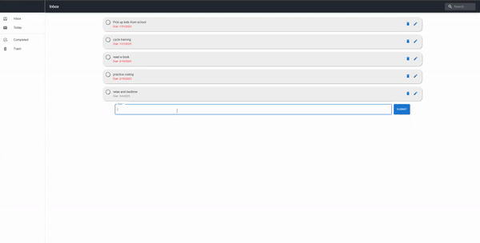

# Rocket Academy Coding Bootcamp: Project 1: Frontend App (Todo list)

Current v1.0.0
Link: https://shawn-goh24.github.io/project1-bootcamp/

## Description

A simple todo list application to keep track on daily tasks.

**Features:**

1. Able to add, delete, edit tasks
2. Search tasks
3. View tasks based on selected drawers

_Sample tasks are added into the application._

## Challenges faced

- Getting the datepicker for MUI to work and get values for dates

## Other features to be added in the future

1. Allowing users to drag and drop tasks
2. Added new destructive message when deleting items
3. New tabs to keep track on upcoming tasks
4. Adding databases for different users as well as saving their tasks
5. Adding labels/priorities/descriptions/subtasks

## Current limitations

1. Unable to save tasks to databases/arrays
2. Tasks will reset when refreshed

## Misc.

To install this locally, use `git clone`, then `npm i` to install all dependencies in this app
This project was bootstrapped with Create React App. In the project directory, you can run:

`npm start`
Runs the app in the development mode.
Open http://localhost:3000 to view it in your browser.

The page will reload when you make changes.
You may also see any lint errors in the console.
