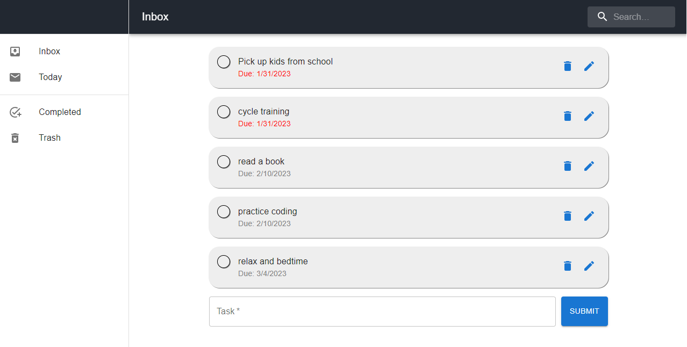

# Rocket Academy Coding Bootcamp: Project 1: Frontend App (Todo list)

https://shawn-goh24.github.io/project1-bootcamp/

## Description

A simple Todo List application to keep track on daily tasks. Sample task are added into the application.
Able to add, delete and edit tasks. Dates are also available to keep track on tasks that are due

## Sample Images

## Available Scripts

This project was bootstrapped with [Create React App](https://github.com/facebook/create-react-app). In the project directory, you can run:

### `npm start`

Runs the app in the development mode.\
Open [http://localhost:3000](http://localhost:3000) to view it in your browser.

The page will reload when you make changes.\
You may also see any lint errors in the console.

https://jsonplaceholder.typicode.com/todos
